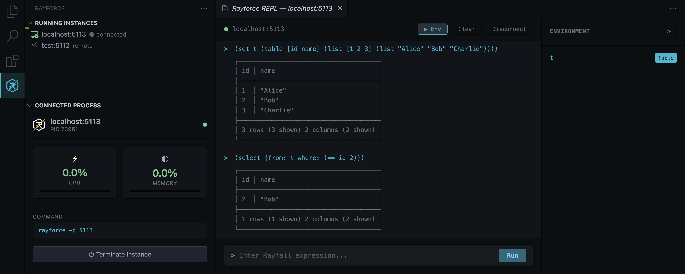

<h1>Runtime Manager and Syntax Highlighting for <a href="https://rayforcedb.com">RayforceDB</a></h1>

View and connect to running local and remote instances, monitor CPU and memory usage of local instances, send commands via interactive integrated REPL, introspect the environment variables

<h3>🎨 As a bonus, full syntax highlighting for <code>.rfl</code> and <code>.rf</code> files</h3>

<h2>Installation</h2>

Install from the <a href="https://marketplace.visualstudio.com/items?itemName=RayforceDB.rayforce-vscode">VS Code Marketplace</a> or search for <strong>"Rayforce"</strong> in VS Code extensions.

<h2>License</h2>

MIT

