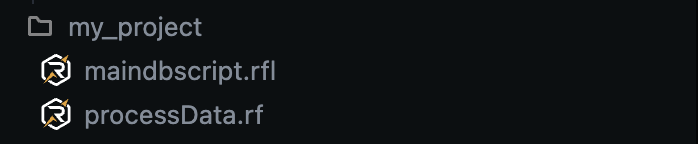
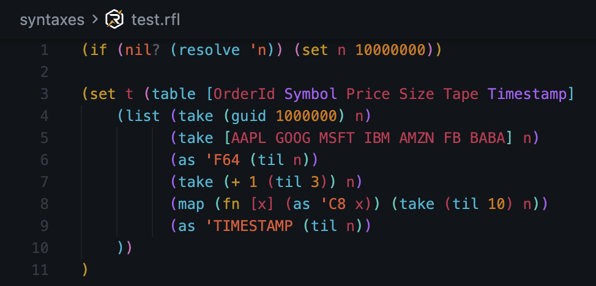

# :material-fountain-pen: Appearance

The RayforceDB VS Code Extension provides visual enhancements to make working with Rayfall code more enjoyable and efficient.

##   Custom File Icons

Custom icons are provided for Rayfall source files to help you easily identify them in your project (`.rfl`)

!!! note ""
    Support for both light and dark themes :)

## :material-text: Syntax Highlighting

Full syntax highlighting support for the Rayfall programming language

The syntax highlighting makes your Rayfall code more readable and helps catch syntax errors at a glance.
