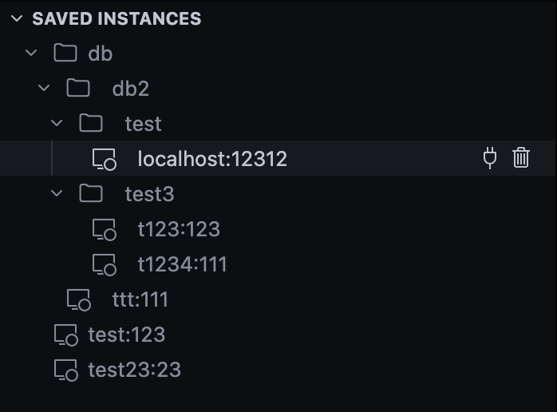

# :fontawesome-solid-computer: Instance Manager

The Instance Manager provides a comprehensive view of all your RayforceDB instances, both local and remote.

## :material-content-save: Saved Instances and Folder Organization

Save frequently used remote instances for quick access. Saved instances are persistent, so you don't need to set them up every time you open VS Code.

!!! note ""
    Organize your saved instances into handy folders and subfolders:

    - Create folders to group related instances
    - Create subfolders for even better organization
    - Drag and drop instances between folders
    - Rename or delete folders as needed

## :material-network: Local Instances

The extension automatically detects running local RayforceDB instances on your machine.

