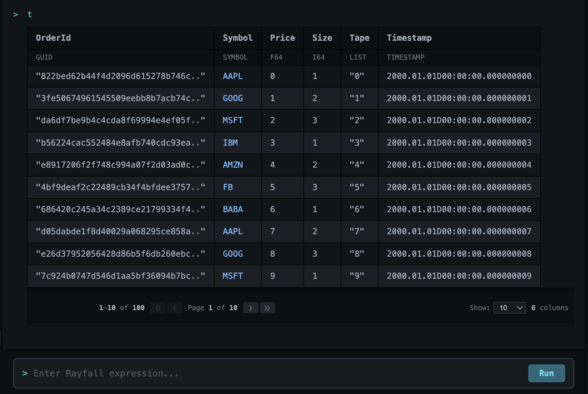
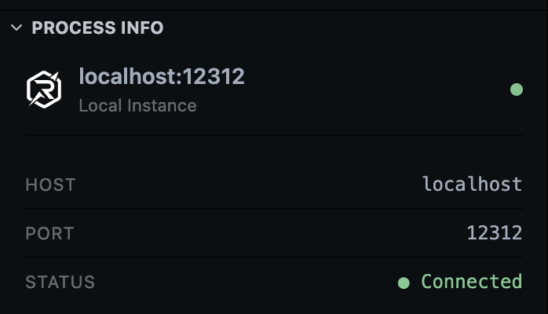

# :simple-typer: Interactive REPL

The RayforceDB VS Code Extension includes a fully integrated REPL panel that makes it easy to interact with your RayforceDB instances.

### :octicons-eye-16: Easy Command Execution and Environment Variable Inspection

Simply type your Rayfall commands in the REPL input area and press Enter to execute them. The REPL provides immediate feedback with formatted output.

Easily inspect environment variables in your connected instance. The REPL provides access to all defined variables, making it simple to explore and understand your RayforceDB environment.

### :material-robot: Autocomplete Support

The REPL includes intelligent autocomplete that suggests built-in Rayfall functions, keywords and special forms, yype names and constants,

Just start typing and get helpful suggestions as you code.

### :material-format-size: Formatted Output

The REPL displays results in a beautifully formatted way:

- Tables are rendered with proper alignment
- Lists and dictionaries are clearly structured
- Error messages are highlighted for easy identification
- Large results support pagination

## :material-connection: Connection Status

The REPL shows your current connection status in the panel title, displaying the host and port of the connected instance.

